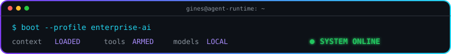
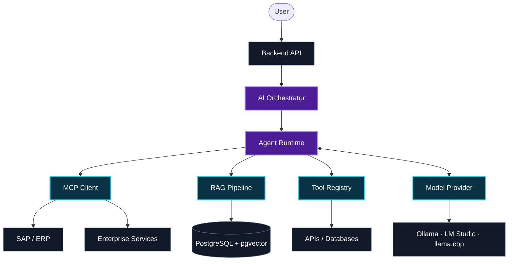

<div align="center">


<a href="https://git.io/typing-svg"></a>

**Designing production AI systems that connect models with software, enterprise data and business operations.**

`.NET` · `AI Agents` · `MCP` · `RAG` · `Local AI` · `PostgreSQL` · `SAP`

<br>




</div>


## `> whoami`

<div align="center">

</div>

I'm an **AI / Backend Engineer focused on agentic systems**.

I engineer the system around the model: backend APIs, orchestration, tools, MCP servers, RAG pipelines, memory, databases, enterprise integrations and local inference.

My main backend stack is **C# / .NET**, supported by Python for AI and inference and Go for lightweight services and developer tooling. I approach AI as an **engineering problem**, not a prompting exercise.

> **I don't just want models that can talk.**<br>
> **I want models that can understand context, use tools, interact with systems and get real work done.**

```yaml
focus:
  - production agentic systems
  - AI orchestration and tool calling
  - MCP and enterprise integrations
  - RAG, memory and semantic retrieval
  - local and privacy-first inference
  - SAP / ERP-connected agents
```

---

## `> architecture`

### The model is one component

Systems where the model is only one component of a larger architecture.



<div align="center">

### Models + Context + Agents + Tools + Data + Infrastructure

</div>

### Local-first AI

I have a strong interest in running AI **locally and privately**: Ollama, LM Studio, llama.cpp, GGUF quantization, local embeddings, local RAG and on-device inference.

I believe a lot of business AI will run much closer to where the data lives—especially when that data is private, operational or sensitive.

### Enterprise AI

```text
Enterprise Data → ERP / SAP / SQL / APIs → Integration Layer
       → MCP + Tools + RAG → Agent Orchestration → LLM
```

Not replacing existing systems. **Building an intelligent, controlled layer on top of them.**

---

## `> tech --stack`

<div align="center">


<br><br>


</div>

<table>
<tr>
<td valign="top" width="25%">

### Agents

Agent runtimes · MCP · Tool Calling · Memory · Planning · Multi-agent Systems · Guardrails

</td>
<td valign="top" width="25%">

### Knowledge

RAG · Embeddings · Hybrid Search · Reranking · pgvector · Grounding · Citations

</td>
<td valign="top" width="25%">

### Inference

Local LLMs · Ollama · llama.cpp · GGUF · Quantization · Speech · Multimodal AI

</td>
<td valign="top" width="25%">

### Platform

Python · .NET · Go · PostgreSQL · Docker · Linux · Kubernetes · Observability

</td>
</tr>
</table>

---

## `> ./current_lab.sh`

```console
gines@local-ai:~$ ./current_lab.sh
[+] building GINESAI.API on .NET 10
[+] designing Ontelia's enterprise intelligence layer
[+] connecting agents to MCP, RAG, SAP and real tools
[+] keeping private inference close to company data
```

### GINESAI.API

Reusable backend foundation for private AI agents and AI applications.

```text
.NET 10 · Minimal APIs · PostgreSQL · pgvector · Dapper · JWT
```

```text
Api
 ├── Auth / Users / Sessions / Chat
 ├── Application Services
 ├── Domain Rules
 ├── AI Orchestration
 │    ├── Agents
 │    ├── Models
 │    ├── Tools
 │    ├── Memory
 │    └── RAG
 ├── MCP
 └── Integrations
      ├── SAP
      ├── Ollama
      └── LM Studio
```

The backend owns deterministic behavior and authorization. Agents reason. Tools perform controlled actions. Integrations communicate with external systems.

### Ontelia

Future AI company and platform for creating an **intelligent layer over company infrastructure**.

```text
                     ONTELIA
                        │
                  ORCHESTRATOR
                        │
          ┌─────────────┼─────────────┐
          ▼             ▼             ▼
         MCP           RAG          AGENTS
          │             │             │
          ▼             ▼             ▼
      ERP / SAP      Knowledge     Workflows
      Databases      Documents        APIs
```

Its direction is local-first enterprise AI for companies with sensitive data: private inference, business capabilities exposed as typed tools, and agents operating with explicit permissions.

### Engineering right now

- **Agent runtimes** — orchestration, routing, memory, structured output and confirmation flows.
- **MCP infrastructure** — narrow, typed and permission-aware business capabilities.
- **Private RAG** — PostgreSQL + pgvector, hybrid retrieval, reranking, tenant isolation and citations.
- **Local inference** — Ollama, LM Studio, llama.cpp, GGUF and hardware-aware quantization.
- **SAP agents** — controlled access to sales, inventory, operations and enterprise workflows.
- **Production visibility** — traces, model/tool latency, tokens, errors and audit logs.

### Current signal

```yaml
status: building
mode: local_first
obsession: useful_agents
next_frontier:
  - advanced_rag
  - multi_agent_systems
  - inference_optimization
  - multimodal_and_edge_ai
  - enterprise_semantic_layers
```

<details>
<summary><b>Previous projects / origin story</b></summary>
<br>

These projects show where I came from; they are not necessarily under active development.

- **[AI Basic Studio](https://github.com/GinesMr/GoAiBasicStudio)** — Local LLM terminal environment built with Go, Bubble Tea and Ollama.
- **[Orbit Wallet](https://github.com/GinesMr/crypto_app)** · **[Backend](https://github.com/GinesMr/OrbitWalletBackend)** — Non-custodial Ethereum wallet built with Flutter and Go.
- **TerraEsphere** — IoT soil-monitoring system and winner of Spain's 2024 National Telecommunications Olympiad.

</details>

---

## `> cat philosophy.txt`

```text
What is deterministic?       → Backend code
What requires reasoning?     → Agent / LLM
What performs an action?     → Typed tool
How is it exposed?           → MCP / Integration
What knowledge is required?  → RAG / Database / API
Where should data live?      → Local / Enterprise infrastructure
What can cause harm?         → Authorization / Confirmation / Audit
```

```text
READ  → execute when authorized
WRITE → validate, authorize, confirm when sensitive, then audit
```

Models never receive raw credentials or unrestricted SQL. Business capabilities should be narrow, typed, validated, permission-aware and observable.

I optimize for **correctness, maintainability, architecture clarity, security and developer experience**—then performance and elegance, except where inference, streaming or retrieval changes the order.

<div align="center">

### The model is not the product.
### The system around the model is the product.

</div>

---

## `> git activity`

<div align="center">


</div>

---

<div align="center">

### Build the system around the model.

**Agents · Context · Tools · Data · Infrastructure**

<a href="https://www.linkedin.com/in/gin%C3%A9s-mart%C3%ADnez-ruiz-696b45354/"></a>
<a href="https://github.com/GinesMr?tab=repositories"></a>

<br><br>

<sub>AI is much more interesting when it can actually do something.</sub>


</div>
